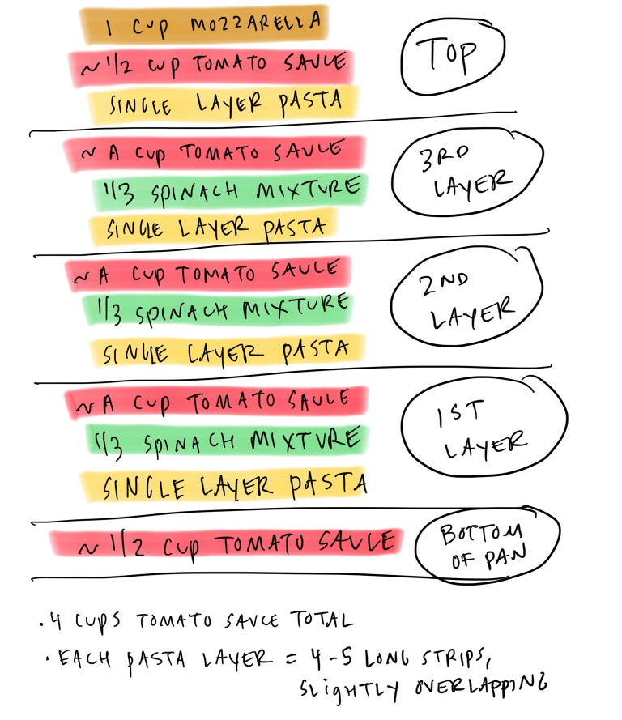

# Easiest Spinach Lasagna

```
Author: Julia Turshen
Prep Time: 15 minutes
Cook Time: 55 minutes
Total Time: 70 minutes (plus 15 minutes resting)
Yield: 6-8 servings
```

## Ingredients

- 1 pound dried regular lasagna noodles (not the no-boil type)
- 3 cups (12 ounces) grated low-moisture mozzarella, coarsely grated
- 1 cup finely grated Parmesan
- 1 cup whole milk ricotta
- 1 cup creme fraiche (or 1/2 cup heavy cream)
- 1 pound frozen spinach, defrosted and squeezed dry
- 1 tablespoon kosher salt
- 1 tablespoon garlic powder
- 1 tablespoon dried oregano
- 1 teaspoon freshly ground black pepper
- 4 cups (32 ounces or 1 quart) your favorite tomato sauce (Rao's recommended)
- Cooking spray or a tiny bit of olive oil (for the aluminum foil)

## Instructions

- Preheat your oven to 400°F.
- Place the lasagna noodles in a large bowl or roasting dish and cover with very hot tap water (if your tap water doesn't get that hot, do a combination of hot tap water and boiling water). Let the noodles soak while you prepare the rest of the ingredients.
- Set aside 1 cup of the grated mozzarella (you'll use this to top the lasagna).
- Place the remaining 2 cups of mozzarella in a large bowl along with the Parmesan, ricotta, creme fraiche (or heavy cream), spinach, salt, garlic powder, dried oregano, and black pepper. Stir everything well to combine. This mixture will be quite thick (easiest to mix with your hand, almost like making dough).
- Place a 9-by-13-inch baking dish on top of a sheet pan (this will make it easier to get the lasagna in and out of the oven).
- Place 1/2 cup of tomato sauce in the bottom of the baking dish. Spread the sauce with a spoon to cover the surface of the dish.
- Take a few of the lasagna noodles out of the hot water and just let any excess water drip back into the water bowl. Layer the pasta in a single layer over the sauce with the edges slightly overlapping (you'll need about 4-5 long strips per layer).
- Spread a third of the spinach mixture over the pasta and then spread a cup of tomato sauce over that.
- Repeat the process two more times. At this point you'll have a naked layer of pasta on top and you'll have used up all of your spinach mixture. All that should remain is about 1/2 cup tomato sauce and the cup of mozzarella you set aside.
- Spread that last bit of sauce on top of the pasta and sprinkle the mozzarella evenly on top.
- Spray a piece of aluminum foil with cooking spray (or rub with oil) and cover the lasagna with it (this helps to keep the cheese from sticking to the foil).
- Bake for 30 minutes, then uncover the lasagna and bake until bubbling and the cheese on top is golden brown, about 25 additional minutes.
- Let the lasagna rest at room temperature for at least 15 minutes before slicing and serving. This lets the pasta fully absorb all of the bubbling sauce, so you don't end up with soupy slices.

## A Visual for Lasagna Layering



## Notes

- Definitely put your baking pan on top of a sheet pan — it will catch any drips, and it will also make getting it in and out of the oven so much easier.
- Instead of spinach, you could do any cooked vegetable (sautéed mushrooms, roasted butternut squash, whatever).
- You can add a little freshly grated nutmeg to the cheese mixture if you want.
- The key to this recipe is soaking regular dry lasagna noodles in hot water before layering them. No boiling noodles. No separate pot of hot water. No sticking noodles.
- Source: https://juliaturshen.substack.com/p/easiest-spinach-lasagna